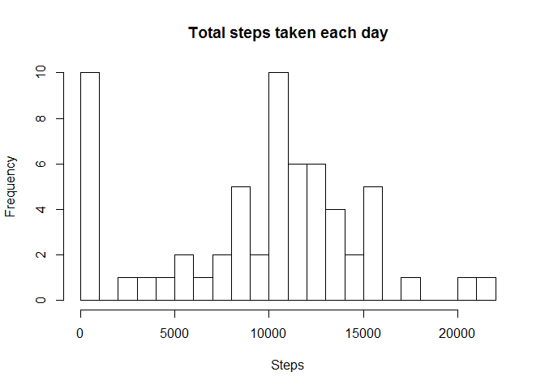
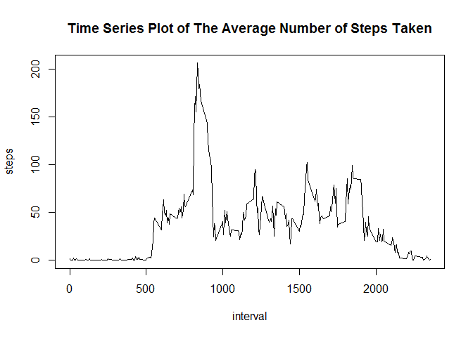
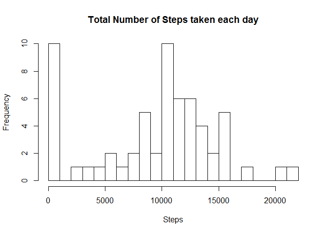
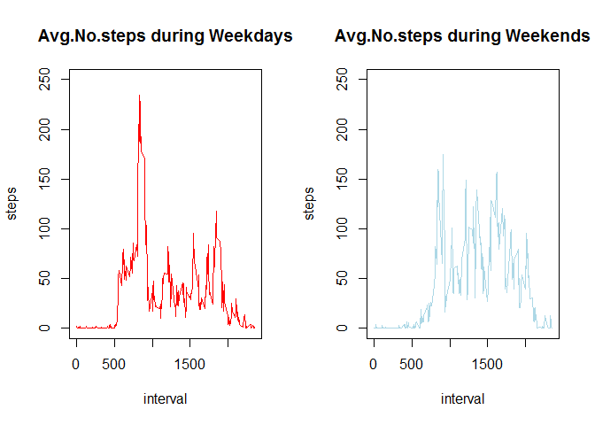

# Reproducible Research Project 1
Shawn Dong  
October 7, 2016  


Download and read data


```r
download.file(url ="https://d396qusza40orc.cloudfront.net/repdata%2Fdata%2Factivity.zip", dest = paste(getwd(), "/activity.zip", sep = ""))
activity <- unzip("activity.zip") 
activity <- read.csv(activity, header = TRUE)
head(activity)
```

```
##   steps       date interval
## 1    NA 2012-10-01        0
## 2    NA 2012-10-01        5
## 3    NA 2012-10-01       10
## 4    NA 2012-10-01       15
## 5    NA 2012-10-01       20
## 6    NA 2012-10-01       25
```

Histogram of total number of steps taken each day


```r
## massage the data
Nsteps <- aggregate(activity["steps"], by = list(date = activity$date), FUN = sum, na.rm = TRUE)
hist(Nsteps$steps, main = "Total steps taken each day", xlab = "Steps", ylab = "Frequency", breaks = 30)
```

<!-- -->

Mean and median number of steps taken each day


```r
## calculation
meanstep <- mean(Nsteps$steps)
medianstep <- median(Nsteps$steps)
print(paste("The mean and median number of steps taken each day is respectively", meanstep, "and", medianstep))
```

```
## [1] "The mean and median number of steps taken each day is respectively 9354.22950819672 and 10395"
```

Time series plot of the average number of steps taken


```r
## frame the data
Asteps <- aggregate(activity["steps"], by = list(interval = activity$interval), FUN = mean, na.rm = TRUE)
## make the plot
plot(Asteps$interval, Asteps$steps, type = "l", xlab = "interval", ylab = "steps", main = "Time Series Plot of The Average Number of Steps Taken")
```

<!-- -->

The 5-minute interval that, on average, contains the maximum number of steps


```r
## figure out the order of the maximum number of steps
indicator <- which.max(Asteps$steps)
## find out the exact interval
print(paste("The 5-minute interval that, on average, contains the maximum number of steps is:", Asteps$interval[indicator]))
```

```
## [1] "The 5-minute interval that, on average, contains the maximum number of steps is: 835"
```

Code to describe and show a strategy for imputing missing data
Histogram of the total number of steps taken each day after missing values are imputed


```r
## The strategy is just to set na.rm = TRUE
totalSteps <- aggregate(activity["steps"], by = list(dates = activity$date), FUN = sum, na.rm = TRUE)
hist(totalSteps$steps, breaks = 30, main = "Total Number of Steps taken each day", xlab = "Steps", ylab = "Frequency")
```

<!-- -->

Panel plot comparing the average number of steps taken per 5-minute interval across weekdays and weekends


```r
## tranform the date to weekdays
date <- as.Date(as.character(activity$date))
wdate <- weekdays(date)
## check whether the day is weekday or weekend
weekendindicator <- (wdate == "Saturday" | wdate == "Sunday")
weekindicator <- (wdate != "Saturday" & wdate != "Sunday")
## redefine the data
wdate[weekendindicator] <- "Weekends"
wdate[weekindicator] <- "Weekdays"
## make the data.frame
stepdate <- aggregate(activity["steps"], by = list(date = wdate, interval = activity$interval), FUN = mean, na.rm = TRUE)
## make the plot
par(mfrow = c(1, 2))
with(stepdate[stepdate$date == "Weekdays", ], plot(interval, steps, type = "l", col = "red", ylim = c(0, 250), main = "Avg.No.steps during Weekdays"))
with(stepdate[stepdate$date == "Weekends", ], plot(interval, steps, type = "l", col = "light blue", ylim = c(0, 250), main = "Avg.No.steps during Weekends"))
```

<!-- -->
